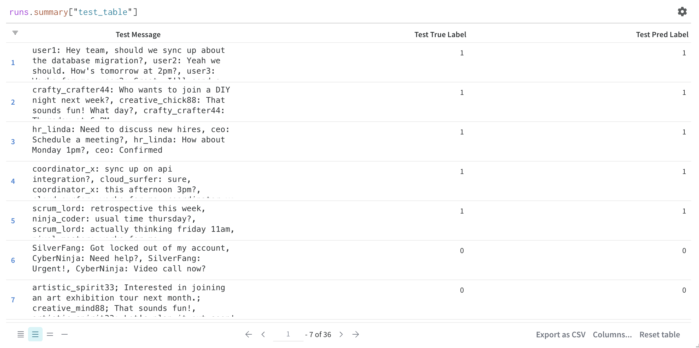

# Calendar Event Detection from Chat Streams

This project implements a real-time calendar event detection system from chat streams using BERT-based clustering and classification. The system monitors chat messages, clusters related conversations, and identifies potential calendar events using deep learning.

## 🚀 Getting Started with Docker

### Quick Start

```bash
# Pull the pre-built Docker image
docker pull stanleydukor/calendar-event

# Run inference client
docker run stanleydukor/calendar-event python client.py ws://143.110.238.245:8000/stream

# Train model
docker run stanleydukor/calendar-event python train.py

# Save the trained model for inference
docker run stanleydukor/calendar-event python save_model.py
```

### Building and Running Locally

Clone the repository:

```bash
git clone https://github.com/stanleydukor/CalendarEvent.git
cd CalendarEvent
```

### Project Structure

```
.
├── checkpoints/         # Trained model checkpoints
├── Data/                # Training data
│   └── data.csv
├── Dataset/             # Dataset preprocessing
│   └── dataset.py
├── Inference/           # Inference codes
├── Model/               # Model architecture
│   └── model.py
├── results/             # Detected calendar events
│   ├── event_0001.json
│   ├── event_0002.json
│   └── ...
├── train.py             # Training script
├── trainer.py           # Training utilities
├── utils.py             # Helper functions
└── client.py            # Streaming client
```

## 🔧 Technical Implementation

### Data Generation and Model Architecture

1. **Synthetic Dataset Generation**

   - Created a synthetic dataset (`Data/data.csv`) to train the BERT model
   - Dataset includes various conversation patterns representing calendar events
   - Augmented with different time formats, meeting platforms, and conversation styles

2. **Model Architecture Choice**
   - Selected BERT encoder + classifier approach instead of decoder-only LLM for several reasons:
     - Better performance on shorter text sequences
     - More efficient for real-time processing
     - Lower computational requirements
     - Better handling of contextual relationships in conversations

### Training and Evaluation

The model was trained using PyTorch Lightning with the following configuration:

- BERT base uncased as encoder
- Binary classification head
- AdamW optimizer with learning rate 2e-5
- Batch size of 2
- 50 epochs


_Model evaluation metrics from Weights & Biases dashboard_

### Real-time Message Processing

1. **Message Clustering**

   - Messages are grouped into conversation clusters using cosine similarity
   - Similarity computed on BERT-encoded message representations
   - Threshold of 0.8 for cluster membership
   - Handles interleaved conversations effectively

2. **Event Detection Pipeline**

   ```python
   message → encode → cluster → classify → extract details → save
   ```

3. **Output Format**
   - Detected events are saved as JSON files in `results/`

Example event JSON:

```json
{
  "lines": [
    {
      "ts": 1704100456.6682845,
      "user": "almoxarife",
      "seqid": 151681,
      "message": "how's thursday evening look for everyone?"
    },
    {
      "ts": 1704100457.0682836,
      "user": "muh2000",
      "seqid": 151682,
      "message": "sounds good, around 7pm UTC?"
    }
  ]
}
```
